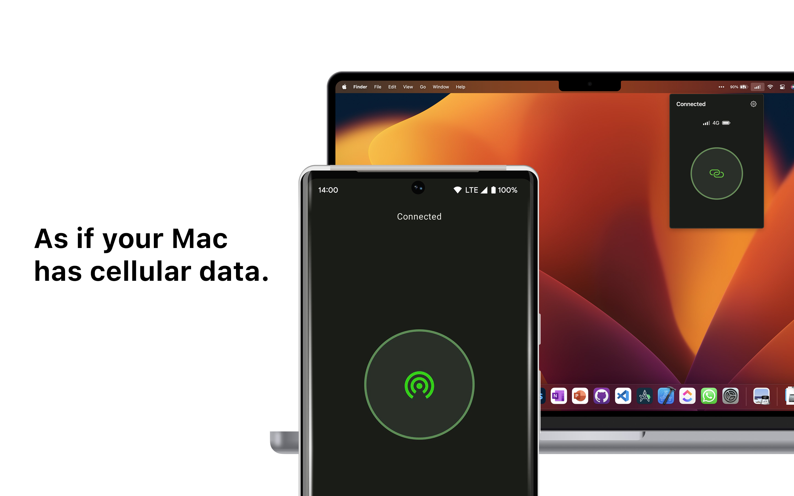
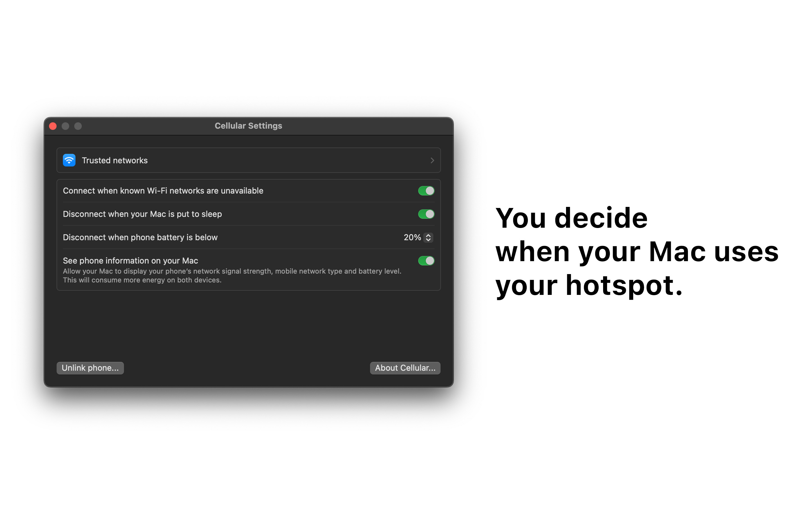
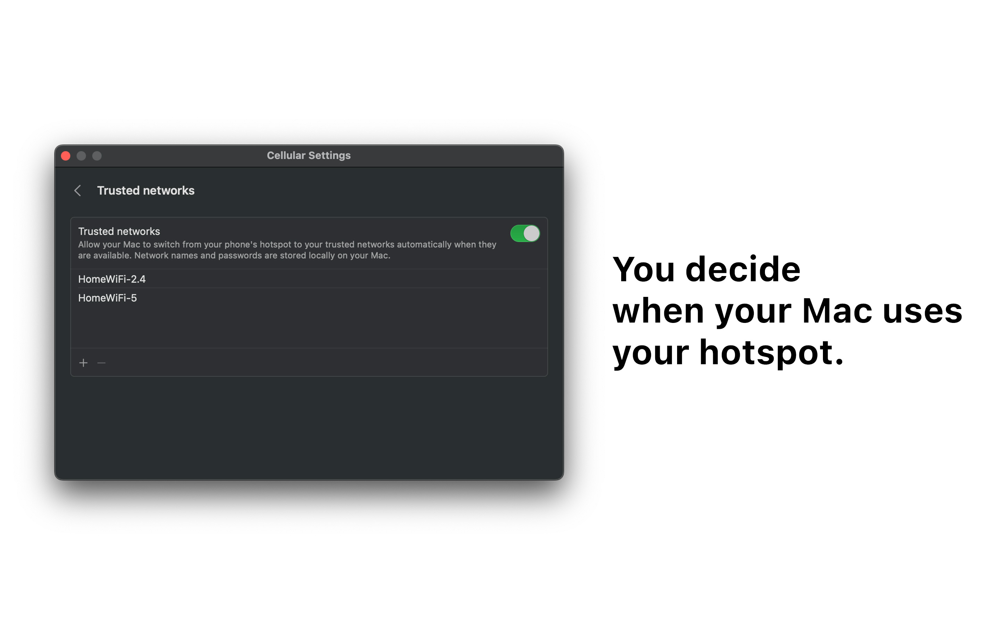

If you're looking for code documentation, view [this document](DEVDOCS.md) instead.

# About

Cellular was built with a simple goal in mind - to allow your Mac to connect to your phone's mobile hotspot seamlessly, as if your Mac has cellular data connectivity.

Cellular is a utility that brings your Mac and your Android phone closer together. When your Mac goes out of range of known Wi-Fi networks, Cellular seamlessly switches your Mac's internet connection to your phone's hotspot. And when you go in range of your trusted networks, Cellular intelligently turns off your phone's hotspot and reconnects you to the trusted network, saving energy while providing ultimate convenience.

# Features

- Connect to mobile hotspot seamlessly when other Wi-Fi networks are not available
- Disconnect from mobile hotspot automatically when computer is put to sleep
- Disconnect from mobile hotspot automatically when trusted Wi-Fi networks are available
- View phone information such as cell signal strength, network type and battery level from the menu bar of your Mac
- Turn off hotspot automatically when phone battery is below a set limit

# Screenshots

    
    
    

# Download

**Option 1: Compile from source**

Verify the code and compile Cellular using Xcode 15 by yourself.

**Option 2: Download for free from GitHub Releases**

Try Cellular immediately by downloading it from this repository. You will have to update Cellular manually when a new version is released.

**Option 3: Purchase from the Mac App Store**

Purchase Cellular for a fixed fee of USD 2.99 (prices vary in different countries) and receive automatic updates the moment they are released. By purchasing Cellular, you are supporting my future software development work and even greater projects!

Download [here](https://apps.apple.com/app/cellular/id6463124697).

# Looking for Cellular Companion?

View the source code for Cellular Companion on [this repository](https://github.com/XuanHanTan/cellular-companion).

# Credits

This app was designed and built by Xuan Han Tan. Learn more about me by visiting [my website](https://xuanhan.me/).

© Xuan Han Tan 2023. All rights reserved.
